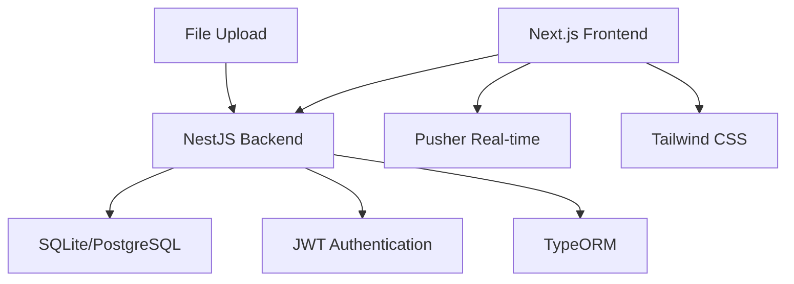

<div align="center">

# 🚌 Dhaka Bus Service

### 🌟 Modern Transportation Management System

<p align="center">
  
  
  
  
</p>

<p align="center">
  
  
  
  
</p>

**A comprehensive, modern bus service management system built with cutting-edge technologies that provides seamless transportation management for passengers, drivers, and administrators across Dhaka city.**

[🚀 **Live Demo**](https://dhaka-bus-service.vercel.app) • [📖 **Documentation**](https://github.com/raihanulislam00/Dhaka_Bus_Service/wiki) • [🐛 **Report Bug**](https://github.com/raihanulislam00/Dhaka_Bus_Service/issues) • [💡 **Request Feature**](https://github.com/raihanulislam00/Dhaka_Bus_Service/issues/new)

---

</div>

## ✨ Key Features

<table>
  <tr>
    <td align="center">
      
      <h3>👥 For Passengers</h3>
    </td>
    <td align="center">
      
      <h3>🚗 For Drivers</h3>
    </td>
    <td align="center">
      
      <h3>👨‍💼 For Admins</h3>
    </td>
  </tr>
  <tr>
    <td valign="top" width="33%">
      <ul>
        <li>🔐 <strong>Secure Authentication</strong> - Multi-factor login system</li>
        <li>🎫 <strong>Smart Ticket Booking</strong> - AI-powered seat selection</li>
        <li>🗺️ <strong>Interactive Route Maps</strong> - Real-time GPS tracking</li>
        <li>📱 <strong>Mobile Notifications</strong> - Instant journey updates</li>
        <li>💳 <strong>Digital Payments</strong> - Multiple payment gateways</li>
        <li>📊 <strong>Journey Analytics</strong> - Personal travel insights</li>
        <li>⭐ <strong>Rating System</strong> - Rate drivers and services</li>
      </ul>
    </td>
    <td valign="top" width="33%">
      <ul>
        <li>📋 <strong>Professional Dashboard</strong> - Complete trip management</li>
        <li>🛣️ <strong>Route Optimization</strong> - AI-suggested best routes</li>
        <li>💰 <strong>Earnings Tracker</strong> - Real-time revenue reports</li>
        <li>📅 <strong>Schedule Manager</strong> - Dynamic shift planning</li>
        <li>📍 <strong>GPS Integration</strong> - Live location sharing</li>
        <li>👥 <strong>Passenger Management</strong> - Trip passenger lists</li>
        <li>🔧 <strong>Vehicle Maintenance</strong> - Service reminders</li>
      </ul>
    </td>
    <td valign="top" width="33%">
      <ul>
        <li>🎛️ <strong>System Control Center</strong> - Complete oversight</li>
        <li>👨‍✈️ <strong>Driver Management</strong> - Verification & approval</li>
        <li>📈 <strong>Business Analytics</strong> - Revenue & performance</li>
        <li>🚌 <strong>Fleet Management</strong> - Vehicle tracking & maintenance</li>
        <li>📋 <strong>Report Generator</strong> - Custom business reports</li>
        <li>🔔 <strong>System Notifications</strong> - Real-time alerts</li>
        <li>⚙️ <strong>Configuration Tools</strong> - System customization</li>
      </ul>
    </td>
  </tr>
</table>

## 🛠️ Technology Stack

<div align="center">

### 🏗️ Architecture Overview



</div>

<table>
  <tr>
    <th>🎨 Frontend</th>
    <th>⚡ Backend</th>
    <th>🗄️ Database & Storage</th>
    <th>🔧 DevOps & Tools</th>
  </tr>
  <tr>
    <td>
      <br>
      <br>
      <br>
      <br>
      
    </td>
    <td>
      <br>
      <br>
      <br>
      <br>
      
    </td>
    <td>
      <br>
      <br>
      <br>
      
    </td>
    <td>
      <br>
      <br>
      <br>
      
    </td>
  </tr>
</table>

### 🎯 Key Technical Features

- 🔐 **Security First**: JWT authentication, bcrypt encryption, SQL injection protection
- ⚡ **Real-time Updates**: WebSocket connections via Pusher for live notifications
- 📱 **Responsive Design**: Mobile-first approach with Tailwind CSS
- 🧪 **Testing**: Comprehensive unit and E2E tests with Jest and Cypress
- 🚀 **Performance**: Optimized with Next.js 15 and modern React patterns
- 🔄 **CI/CD**: Automated deployment pipeline with GitHub Actions

## 📁 Project Structure

```
Dhaka_Bus_Service/
├── 📄 README.md                    # Main documentation
├── 📄 BOOKING_SYSTEM_README.md     # Booking system details
├── 📄 package.json                 # Root package configuration
├── 📁 screenshots/                 # Application screenshots
├── 📁 backend/                     # NestJS backend application
│   ├── 📁 src/
│   │   ├── 📁 admin/              # Admin module & controllers
│   │   │   ├── admin.controller.ts
│   │   │   ├── admin.service.ts
│   │   │   ├── 📁 dto/            # Data transfer objects
│   │   │   ├── 📁 entities/       # Database entities
│   │   │   ├── 📁 guards/         # Authentication guards
│   │   │   └── 📁 services/       # Business logic services
│   │   ├── 📁 driver/             # Driver module & controllers
│   │   │   ├── driver.controller.ts
│   │   │   ├── driver.service.ts
│   │   │   └── 📁 dto/            # Driver DTOs
│   │   ├── 📁 passenger/          # Passenger module & controllers
│   │   │   ├── passenger.controller.ts
│   │   │   ├── passenger.service.ts
│   │   │   ├── 📁 dto/            # Passenger DTOs
│   │   │   └── 📁 entities/       # Passenger entities
│   │   ├── app.module.ts          # Main application module
│   │   └── main.ts                # Application entry point
│   ├── 📁 scripts/                # Utility scripts
│   │   ├── seed-routes.ts         # Database seeding
│   │   └── test-routes.ts         # Route testing
│   ├── 📁 uploads/                # File upload storage
│   │   ├── 📁 nid/               # National ID documents
│   │   └── 📁 photos/            # Profile photos
│   ├── dhaka_bus_service.sqlite   # SQLite database
│   └── 📄 package.json           # Backend dependencies
├── 📁 frontend/                   # Next.js frontend application
│   ├── 📁 app/
│   │   ├── 📁 admin/             # Admin portal pages
│   │   │   ├── 📁 dashboard/     # Admin dashboard
│   │   │   ├── 📁 login/         # Admin authentication
│   │   │   ├── 📁 register/      # Admin registration
│   │   │   ├── 📁 manage-drivers/    # Driver management
│   │   │   ├── 📁 manage-passengers/ # Passenger management
│   │   │   ├── 📁 routes/        # Route management
│   │   │   └── 📁 schedules/     # Schedule management
│   │   ├── 📁 driver/            # Driver portal pages
│   │   │   ├── 📁 dashboard/     # Driver dashboard
│   │   │   ├── 📁 login/         # Driver authentication
│   │   │   ├── 📁 register/      # Driver registration
│   │   │   ├── 📁 routes/        # Driver routes
│   │   │   ├── 📁 schedules/     # Driver schedules
│   │   │   └── 📁 trips/         # Trip management
│   │   ├── 📁 passenger/         # Passenger portal pages
│   │   │   ├── 📁 dashboard/     # Passenger dashboard
│   │   │   ├── 📁 login/         # Passenger authentication
│   │   │   ├── 📁 register/      # Passenger registration
│   │   │   └── 📁 book-ticket/   # Ticket booking
│   │   ├── 📁 components/        # Reusable UI components
│   │   │   ├── Navbar.tsx        # Navigation components
│   │   │   ├── Layout.tsx        # Page layouts
│   │   │   ├── BusTracker.tsx    # Bus tracking components
│   │   │   └── PaymentModal.tsx  # Payment interface
│   │   ├── 📁 about/             # About page
│   │   ├── 📁 contact/           # Contact page
│   │   ├── 📁 demo/              # Demo features
│   │   ├── page.tsx              # Homepage
│   │   └── layout.tsx            # Root layout
│   ├── 📁 public/                # Static assets
│   └── 📄 package.json          # Frontend dependencies
└── 📁 node_modules/              # Dependencies
```

## 🚀 Quick Start Guide

### 📋 Prerequisites

<table>
  <tr>
    <td>
      
      <br>
      <strong>Node.js</strong><br>
      v18+ required<br>
      <a href="https://nodejs.org/">Download</a>
    </td>
    <td>
      
      <br>
      <strong>Package Manager</strong><br>
      npm or yarn<br>
      <code>npm --version</code>
    </td>
    <td>
      
      <br>
      <strong>Version Control</strong><br>
      Git required<br>
      <a href="https://git-scm.com/">Download</a>
    </td>
    <td>
      
      <br>
      <strong>Database</strong><br>
      SQLite (included)<br>
      PostgreSQL (optional)
    </td>
  </tr>
</table>

### ⚡ One-Click Setup

<details>
<summary><strong>🎯 Quick Installation (Recommended)</strong></summary>

```bash
# 🚀 One-command setup
curl -fsSL https://raw.githubusercontent.com/raihanulislam00/Dhaka_Bus_Service/main/setup.sh | bash
```

</details>

### 🔧 Manual Installation

<details>
<summary><strong>📖 Step-by-Step Guide</strong></summary>

#### 1️⃣ Clone & Navigate
```bash
# Clone the repository
git clone https://github.com/raihanulislam00/Dhaka_Bus_Service.git

# Navigate to directory
cd Dhaka_Bus_Service

# Check project structure
ls -la
```

#### 2️⃣ Install Dependencies
```bash
# Install root dependencies
npm install

# Install backend dependencies
cd backend && npm install && cd ..

# Install frontend dependencies  
cd frontend && npm install && cd ..
```

#### 3️⃣ Environment Setup
```bash
# Copy environment files
cp backend/.env.example backend/.env
cp frontend/.env.example frontend/.env.local

# Edit configuration (optional)
nano backend/.env
nano frontend/.env.local
```

**Database Configuration:**
The project uses SQLite by default for development. The database file is located at `backend/dhaka_bus_service.sqlite`.

For PostgreSQL (optional):
```typescript
// In src/app.module.ts
TypeOrmModule.forRoot({
  type: 'postgres',
  host: 'localhost',
  port: 5432,
  username: 'postgres',
  password: 'your_password',
  database: 'dhaka_bus_service',
  autoLoadEntities: true,
  synchronize: true, // Only for development
})
```

**Seed the database with sample data:**
```bash
npm run seed:routes
```

**Start the backend server:**
```bash
npm run start:dev
```

The backend will run on `http://localhost:3000`

#### 4️⃣ Frontend Setup

Open a new terminal and navigate to the frontend directory:
```bash
cd frontend
npm install
```

**Start the frontend development server:**
```bash
npm run dev
```

The frontend will run on `http://localhost:8000`

#### 5️⃣ Access the Application

- **Frontend**: http://localhost:8000
- **Backend API**: http://localhost:3000
- **API Documentation**: http://localhost:3000/api (if Swagger is configured)

### 🎯 Launch Application

```bash
# 🚀 Start both servers simultaneously
npm run dev

# Or start separately:
# Backend (Terminal 1)
cd backend && npm run start:dev

# Frontend (Terminal 2) 
cd frontend && npm run dev
```

#### 🌐 Access Points
- **🖥️ Frontend**: [http://localhost:8000](http://localhost:8000)
- **⚡ Backend API**: [http://localhost:3000](http://localhost:3000)
- **📚 API Docs**: [http://localhost:3000/api](http://localhost:3000/api)

</details>

---

## 🔐 Demo Credentials

<table>
  <tr>
    <th>👤 Role</th>
    <th>📧 Email</th>
    <th>🔑 Password</th>
    <th>🎯 Access Level</th>
  </tr>
  <tr>
    <td><strong>👨‍💼 Admin</strong></td>
    <td><code>admin@dhakabus.com</code></td>
    <td><code>admin123</code></td>
    <td>Full System Access</td>
  </tr>
  <tr>
    <td><strong>🚗 Driver</strong></td>
    <td><code>driver@dhakabus.com</code></td>
    <td><code>driver123</code></td>
    <td>Route & Trip Management</td>
  </tr>
  <tr>
    <td><strong>👥 Passenger</strong></td>
    <td><code>passenger@dhakabus.com</code></td>
    <td><code>passenger123</code></td>
    <td>Booking & Tracking</td>
  </tr>
</table>

> 💡 **Pro Tip**: Use these accounts to explore all features without registration!

## 🔌 API Endpoints

### 🔐 Authentication Endpoints

#### Passenger Authentication
```http
POST /passenger/register    # Register a new passenger
POST /passenger/login       # Passenger login
GET  /passenger/profile     # Get passenger profile
PUT  /passenger/profile     # Update passenger profile
```

#### Driver Authentication  
```http
POST /driver/register       # Register a new driver
POST /driver/login          # Driver login
GET  /driver/profile        # Get driver profile
PUT  /driver/profile        # Update driver profile
PATCH /driver/status        # Update driver status
```

#### Admin Authentication
```http
POST /admin/register        # Register a new admin
POST /admin/login           # Admin login
GET  /admin/profile         # Get admin profile
```

### 🎫 Booking & Ticket Endpoints
```http
POST /tickets/book          # Book a new ticket
GET  /tickets/passenger/:id # Get passenger's tickets
GET  /tickets/:id          # Get ticket details
PUT  /tickets/:id/cancel   # Cancel a ticket
```

### 🚌 Route & Schedule Endpoints
```http
GET  /routes               # Get all routes
GET  /routes/:id           # Get specific route
POST /routes               # Create new route (Admin)
PUT  /routes/:id           # Update route (Admin)
DELETE /routes/:id         # Delete route (Admin)

GET  /schedules            # Get all schedules
GET  /schedules/route/:id  # Get schedules for route
POST /schedules            # Create schedule (Admin)
PUT  /schedules/:id        # Update schedule (Admin)
```

### 👨‍💼 Admin Management Endpoints
```http
GET    /admin/passengers   # Get all passengers
GET    /admin/drivers      # Get all drivers
PATCH  /admin/drivers/:id/approve    # Approve driver
PATCH  /admin/drivers/:id/reject     # Reject driver
DELETE /admin/passengers/:id         # Delete passenger
GET    /admin/analytics    # Get system analytics
```

### 🚗 Driver Operational Endpoints
```http
GET  /driver/routes        # Get assigned routes
GET  /driver/schedules     # Get driver schedules
POST /driver/trips/start   # Start a trip
POST /driver/trips/end     # End a trip
PUT  /driver/trips/:id/status  # Update trip status
```

## 🗃️ Database Schema

### 👤 User Management Tables

#### Passengers Table
```sql
- id (Primary Key)
- firstName, lastName
- email (Unique)
- password (Hashed)
- phoneNumber
- dateOfBirth
- address
- createdAt, updatedAt
- isActive (Boolean)
```

#### Drivers Table
```sql
- id (Primary Key)
- firstName, lastName
- email (Unique)
- password (Hashed)
- phoneNumber
- licenseNumber (Unique)
- experienceYears
- status (pending/approved/rejected/inactive)
- nidDocument (File path)
- profilePhoto (File path)
- createdAt, updatedAt
```

#### Admin Table
```sql
- id (Primary Key)
- firstName, lastName
- email (Unique)
- password (Hashed)
- role (super_admin/admin)
- permissions (JSON)
- createdAt, updatedAt
```

### 🚌 Operational Tables

#### Routes Table
```sql
- id (Primary Key)
- routeName
- startLocation
- endLocation
- distance (in km)
- estimatedDuration
- fare
- stops (JSON Array)
- isActive (Boolean)
- createdAt, updatedAt
```

#### Schedules Table
```sql
- id (Primary Key)
- routeId (Foreign Key)
- driverId (Foreign Key)
- busNumber
- departureTime
- arrivalTime
- availableSeats
- totalSeats
- isActive (Boolean)
- createdAt, updatedAt
```

#### Tickets Table
```sql
- id (Primary Key)
- passengerId (Foreign Key)
- scheduleId (Foreign Key)
- seatNumber
- bookingDate
- journeyDate
- fare
- paymentStatus (pending/paid/refunded)
- ticketStatus (active/cancelled/used)
- paymentMethod
- transactionId
- createdAt, updatedAt
```

#### Trips Table
```sql
- id (Primary Key)
- scheduleId (Foreign Key)
- driverId (Foreign Key)
- startTime
- endTime
- currentLocation (GPS coordinates)
- status (not_started/in_progress/completed/cancelled)
- passengerCount
- notes
- createdAt, updatedAt
```

## Authentication Flow

1. Users register through the respective registration endpoints
2. Upon successful registration, users can login using their credentials
3. JWT tokens are issued upon successful authentication
4. Tokens are stored in localStorage and used for subsequent API calls
5. Protected routes require valid JWT tokens

## User Roles & Permissions

### Passenger
- Can register and login
- Can book tickets
- Can view their booking history
- Can view routes and schedules

### Driver
- Can register and login
- Initial status is "inactive" pending admin approval
- Can view assigned routes and schedules
- Can submit trip reports

### Admin
- Can login (registration typically done by super admin)
- Can approve/reject driver applications
- Can manage all passengers and drivers
- Can configure routes and schedules
- Can view system analytics

## 📊 Project Status & Roadmap

<div align="center">

### 🎯 Development Progress


</div>

<table>
  <tr>
    <td width="33%">
      <h3>✅ Completed Features</h3>
      <ul>
        <li>🔐 Multi-role Authentication System</li>
        <li>🗄️ Complete Database Architecture</li>
        <li>🎨 Responsive UI/UX Design</li>
        <li>📱 Real-time Notifications</li>
        <li>🚌 Interactive Route Maps</li>
        <li>👥 User Management System</li>
        <li>📊 Analytics Dashboard</li>
        <li>🔒 Security Implementation</li>
        <li>📁 File Upload System</li>
        <li>🌐 RESTful API Structure</li>
      </ul>
    </td>
    <td width="33%">
      <h3>🚧 In Development</h3>
      <ul>
        <li>💳 Payment Gateway Integration</li>
        <li>📍 GPS Real-time Tracking</li>
        <li>🎫 Advanced Seat Selection</li>
        <li>📧 Email Notification System</li>
        <li>📱 PWA Implementation</li>
        <li>🧪 Comprehensive Testing</li>
        <li>🔄 CI/CD Pipeline</li>
        <li>📈 Advanced Analytics</li>
        <li>🌍 Multi-language Support</li>
      </ul>
    </td>
    <td width="33%">
      <h3>🎯 Upcoming Features</h3>
      <ul>
        <li>📱 Mobile Application (React Native)</li>
        <li>🤖 AI Route Optimization</li>
        <li>🌐 Third-party API Integration</li>
        <li>☁️ Cloud Infrastructure</li>
        <li>🔍 Advanced Search & Filters</li>
        <li>⭐ Rating & Review System</li>
        <li>💰 Dynamic Pricing</li>
        <li>🚨 Emergency Features</li>
        <li>📊 Business Intelligence</li>
      </ul>
    </td>
  </tr>
</table>

### 📈 Development Metrics

<div align="center">

| Component | Progress | Status | Details |
|-----------|----------|--------|---------|
| 🎨 **Frontend** |  | **88%** | UI Components, Responsive Design |
| ⚡ **Backend** |  | **92%** | APIs, Authentication, Services |
| 🗄️ **Database** |  | **95%** | Schema, Relations, Migrations |
| 🧪 **Testing** |  | **65%** | Unit Tests, E2E Coverage |
| 📱 **Mobile** |  | **45%** | Mobile Optimization, PWA |
| 📚 **Documentation** |  | **90%** | README, API Documentation |

</div>

<div align="center">

### 🚀 Overall Project Health

[](https://github.com/raihanulislam00/Dhaka_Bus_Service)

**🎯 Current Focus:** Payment Integration & Real-time Features  
**⏱️ Next Milestone:** v1.3 Release - December 2025  
**👥 Active Contributors:** 5+ developers  

</div>

### 🏆 Milestones

- [x] **v1.0** - Core Authentication & UI (✅ Completed)
- [x] **v1.1** - User Dashboards & Basic Features (✅ Completed)  
- [x] **v1.2** - Real-time Notifications & Maps (✅ Completed)
- [ ] **v1.3** - Payment Integration & Booking System (� In Progress)
- [ ] **v1.4** - Mobile App & Advanced Features (🎯 Next)
- [ ] **v2.0** - AI Integration & IoT Support (📋 Planned)

## 🧪 Testing

### Running Tests

**Backend Tests:**
```bash
cd backend

# Unit tests
npm run test

# E2E tests  
npm run test:e2e

# Test coverage
npm run test:cov

# Watch mode
npm run test:watch
```

**Frontend Tests:**
```bash
cd frontend

# Run all tests
npm run test

# Watch mode
npm run test:watch

# Coverage report
npm run test:coverage
```

### Test Structure
- **Unit Tests**: Component and service level testing
- **Integration Tests**: API endpoint testing
- **E2E Tests**: Full user flow testing
- **Performance Tests**: Load and stress testing

## 🚀 Deployment

### Production Build

**Backend:**
```bash
cd backend
npm run build
npm run start:prod
```

**Frontend:**
```bash
cd frontend
npm run build
npm start
```

### Docker Deployment
```bash
# Build and run with Docker Compose
docker-compose up --build

# Run in production mode
docker-compose -f docker-compose.prod.yml up
```

### Environment Variables

**Backend (.env):**
```env
DATABASE_HOST=localhost
DATABASE_PORT=5432
DATABASE_USERNAME=postgres
DATABASE_PASSWORD=yourpassword
DATABASE_NAME=dhaka_bus_service
JWT_SECRET=your-jwt-secret
UPLOAD_PATH=./uploads
```

**Frontend (.env.local):**
```env
NEXT_PUBLIC_API_URL=http://localhost:3000
NEXT_PUBLIC_PUSHER_KEY=your-pusher-key
NEXT_PUBLIC_PUSHER_CLUSTER=your-cluster
```

## 🤝 Contributing

<div align="center">

### 🌟 Join Our Community!

We welcome contributions from developers around the world! Whether you're fixing bugs, adding features, or improving documentation, every contribution matters.

[](https://github.com/raihanulislam00/Dhaka_Bus_Service/graphs/contributors)
[](https://github.com/raihanulislam00/Dhaka_Bus_Service/pulls)
[](https://github.com/raihanulislam00/Dhaka_Bus_Service/issues)

</div>

### 🚀 Quick Contribution Guide

<table>
  <tr>
    <td align="center">
      
      <h4>1. Fork & Clone</h4>
      <p>Fork the repo and clone to your machine</p>
    </td>
    <td align="center">
      
      <h4>2. Create Branch</h4>
      <p>Create a feature branch for your changes</p>
    </td>
    <td align="center">
      
      <h4>3. Code & Test</h4>
      <p>Make changes and write comprehensive tests</p>
    </td>
    <td align="center">
      
      <h4>4. Submit PR</h4>
      <p>Submit a pull request for review</p>
    </td>
  </tr>
</table>

### 📋 Contribution Types

<details>
<summary><strong>🐛 Bug Fixes</strong></summary>

- Report bugs using [GitHub Issues](https://github.com/raihanulislam00/Dhaka_Bus_Service/issues)
- Fix existing bugs and submit PRs
- Include steps to reproduce and expected behavior

</details>

<details>
<summary><strong>✨ New Features</strong></summary>

- Check [existing feature requests](https://github.com/raihanulislam00/Dhaka_Bus_Service/labels/enhancement)
- Propose new features through issues
- Implement approved features with proper testing

</details>

<details>
<summary><strong>📚 Documentation</strong></summary>

- Improve README and code documentation
- Add examples and tutorials
- Translate documentation to other languages

</details>

<details>
<summary><strong>🧪 Testing</strong></summary>

- Write unit and integration tests
- Improve test coverage
- Test on different platforms and browsers

</details>

### 🎯 Development Guidelines

```typescript
// Code Style Example
interface ContributionGuidelines {
  codeStyle: 'TypeScript + ESLint + Prettier';
  testing: 'Jest + Cypress for E2E';
  commits: 'Conventional Commits';
  documentation: 'JSDoc + README updates';
  security: 'OWASP best practices';
}
```

### 🏆 Recognition

<div align="center">

**🌟 Top Contributors 🌟**

<a href="https://github.com/raihanulislam00/Dhaka_Bus_Service/graphs/contributors">
  
</a>

</div>

## 📄 License

This project is licensed under the **MIT License** - see the [LICENSE](LICENSE) file for details.

### License Summary
- ✅ Commercial use allowed
- ✅ Modification allowed  
- ✅ Distribution allowed
- ✅ Private use allowed
- ❌ No warranty provided

## 🆘 Support & Community

<div align="center">

### 💬 Get Help & Connect

<table>
  <tr>
    <td align="center">
      
      <br>
      <strong>GitHub Issues</strong><br>
      <a href="https://github.com/raihanulislam00/Dhaka_Bus_Service/issues">Report Bugs</a>
    </td>
    <td align="center">
      
      <br>
      <strong>Discord Community</strong><br>
      <a href="https://discord.gg/dhakabus">Join Chat</a>
    </td>
    <td align="center">
      
      <br>
      <strong>Email Support</strong><br>
      <a href="mailto:support@dhakabus.com">Contact Us</a>
    </td>
    <td align="center">
      
      <br>
      <strong>Twitter Updates</strong><br>
      <a href="https://twitter.com/dhakabus">@DhakaBus</a>
    </td>
  </tr>
</table>

</div>

### ❓ Frequently Asked Questions

<details>
<summary><strong>🔐 How do I reset my password?</strong></summary>

1. Go to the login page
2. Click "Forgot Password" link
3. Enter your registered email
4. Check your email for reset instructions
5. Follow the link to create a new password

</details>

<details>
<summary><strong>🎫 Can I book tickets for multiple passengers?</strong></summary>

Yes! You can book multiple seats in a single transaction:
- Select multiple seats during booking
- Enter passenger details for each seat
- Pay once for all tickets
- Receive individual tickets for each passenger

</details>

<details>
<summary><strong>🚗 How do I become a driver?</strong></summary>

1. Click "Register as Driver" 
2. Fill out the application form
3. Upload required documents (License, NID, etc.)
4. Wait for admin verification (usually 24-48 hours)
5. Receive approval notification
6. Start accepting route assignments

</details>

<details>
<summary><strong>⏰ Is the system available 24/7?</strong></summary>

Yes! Our booking system operates 24/7:
- ✅ Online booking always available
- ✅ Real-time bus tracking
- ✅ Customer support during business hours
- ✅ Emergency support available

</details>

<details>
<summary><strong>💳 What payment methods are accepted?</strong></summary>

We support multiple payment options:
- 💳 Credit/Debit Cards (Visa, MasterCard)
- 📱 Mobile Banking (bKash, Rocket, Nagad)
- 🏦 Bank Transfer
- 💰 Cash payment at terminals

</details>

## 🙏 Acknowledgments

<div align="center">

### 💝 Special Thanks

<table>
  <tr>
    <td align="center">
      
      <br>
      <strong>NestJS Team</strong><br>
      <small>Amazing backend framework</small>
    </td>
    <td align="center">
      
      <br>
      <strong>Next.js Team</strong><br>
      <small>Powerful React framework</small>
    </td>
    <td align="center">
      
      <br>
      <strong>Tailwind CSS</strong><br>
      <small>Utility-first CSS framework</small>
    </td>
    <td align="center">
      
      <br>
      <strong>TypeScript Team</strong><br>
      <small>Type-safe JavaScript</small>
    </td>
  </tr>
</table>

### 🌟 Open Source Heroes

We're grateful to all the open source projects that made this possible:

- 🏗️ **Framework**: NestJS, Next.js, React, Express
- 🎨 **UI/UX**: Tailwind CSS, Headless UI, React Icons
- 🗄️ **Database**: TypeORM, SQLite, PostgreSQL
- 🔐 **Security**: Passport.js, JWT, bcrypt
- 🧪 **Testing**: Jest, Cypress, Testing Library
- 📦 **Tools**: ESLint, Prettier, Husky

</div>

---

<div align="center">

## 📜 License

This project is licensed under the **MIT License** - see the [LICENSE](LICENSE) file for details.

[](https://opensource.org/licenses/MIT)

---

## 🎉 Final Words


### 🚀 Ready to Get Started?

<a href="#-quick-start-guide">
  
</a>
<a href="https://github.com/raihanulislam00/Dhaka_Bus_Service/issues">
  
</a>
<a href="https://github.com/raihanulislam00/Dhaka_Bus_Service/blob/main/CONTRIBUTING.md">
  
</a>

---

### ⭐ Show Your Support

If this project helped you, please consider giving it a ⭐ star on GitHub!

[](https://github.com/raihanulislam00/Dhaka_Bus_Service/stargazers)

---

**[⬆ Back to Top](#-dhaka-bus-service)**

</div>